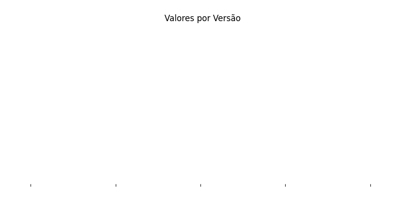

# HousePrices
Repositório para a **[competição do Kaggle:](https://www.kaggle.com/competitions/house-prices-advanced-regression-techniques) Previsão de preço das casas** na cidade de Ames, Iowa (Estados Unidos)

O histórico dos resultados é mostrado abaixo:

## [Versão 1: Primeiro modelo](https://github.com/leandrolinkolnr/Projeto-completo---Machine-Learning/blob/main/Versao%201.ipynb)
- Nesta primeira etapa, realizei apenas o tratamento minimo para os valores nulos para verificar qual seria o resultado sem fazer nenhum tratamento nem engenharia dos dados, ter uma baseline.
- Para simplificar, **substitui todos os valores vazios por -1** e **trabalhei somente com valores numericos**
- Criei o modelo utilizando **3 algoritmos**: **Regressão Linear**, **Árvore de Regressão** e **KNeighborsRegressor** e **avaliamos os resultados** utilizando o **Erro médio absoluto** e o **Erro quadrático médio**.
- Obtive o **score público retornado pelo Kaggle de 0,2548**

## [Versão 2: Analise e limpeza dos dados](https://github.com/leandrolinkolnr/Projeto-completo---Machine-Learning/blob/main/Versao%202.ipynb)
- Iniciei esta versão realizando uma analise dos dados, buscando identificar a importancia de algumas variaveis para o modelo e, após isso, realizei **limpeza e tratamento dos dados**, analisando **valores vazios e informações faltantes** para escolher a melhor estratégia de tratamento:
- Os valores vazios foram tratados de forma diferenciada: quando indicavam a ausência de atributos na casa, como a falta de piscina, foram substituídos por -1, considerando o vazio como informação; em casos de verdadeira ausência de informação, foram substituídos pela média da coluna, moda ou outras abordagens apropriadas.
- Então, obtive o **score público retornado pelo Kaggle de 0.2111**

## [Versão 3: Tratamento dos dados](https://github.com/leandrolinkolnr/Projeto-completo---Machine-Learning/blob/main/Versao%203.ipynb)
- Inicialmente, para o tratamento  dos dados, analisei a correlação entre as datas de construção de algumas partes da casa e notei que as colunas tinham grande similaridade, podendo então, descartá-las.
- Em seguida, utilizei OneHotEncoder e OrdinalEncoder para tratar as colunas textuais e aumentar a quantidade de informações fornecidas ao modelo, com o objetivo de melhorar seu desempenho e sua precisão. No entanto, houve uma queda no score, e notei que o modelo poderia estar memorizando ou se ajustando excessivamente aos dados de treinamento, o que chamamos de Overfitting.
- Obtive o **score público retornado pelo Kaggle de 0.4554**

## [Versão 4: Adicionando novos modelos](https://github.com/leandrolinkolnr/Projeto-completo---Machine-Learning/blob/main/Versao%204.ipynb)
- Primeiramente, reverti alguns tratamentos dos dados realizados na versão anterior, que causaram Overfitting no modelo.
- Em seguida, **retirei os algoritmos Árvore de Regressão e KNeighborsRegressor**, que haviam obtido um desempenho inferior, e adicionei dois novos algoritmos: **XGBoost e RandomForestRegressor**.
- Obtive o **score público retornado pelo Kaggle de 0.1697**

## [Etapa 5: Selecionando os melhores parâmetros](LINK)
- Na versão final, utilizei o **GridSearchCV** para identificar os **melhores parâmetros** dos modelos que apresentaram melhor desempenho, visando aperfeiçoar o modelo.
- Como o RandomForest teve um menor erro quadrático e o XGBoost um menor erro absoluto, os resultando foram:
   - Para o **RandomForest: 0,1537**
   - Para o **XGBoost: 0,1544**

